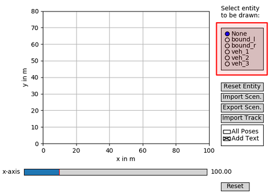
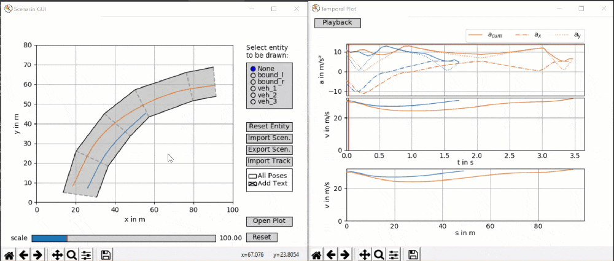

# Scenario Architect


The Scenario Architect is a basic python tool to generate, import and export short scene snapshots. These scenarios can 
be used for safety assessment metric evaluations or other benchmarks.

# List of components
The repository is composed of different components. Each of them is contained in a sub-folder.

| Folder | Description |
|----|----|
 [helper_funcs](helper_funcs) | This python module contains various helper functions used in several other functions, e.g. calculation of splines or velocity profiles.
 [params](params) | This folder holds parameters configuring the Scenario Architect (e.g. export time increments, color styles, vehicle parameters for the automatic velocity-profile initialization)
 [interface_package](interface_package) | This folder holds some python script snippets, which come in handy, when working with the generated scenarios (e.g. extracting a specific time instance from the file).
 [sample_files](sample_files) | This folder holds a couple of sample scenarios generated with the Scenario Architect, as well as an sample track-file that can be imported with the Scenario Architect.

In the root folder is the `ScenarioGUI.py`-file located. This python class holds the main graphical user interface (GUI) 
used for the creation and modification of scenarios.

# Python Version and Dependencies
All the code was tested with Python 3.7, newer versions should also work. The code was tested for compliance with 
Linux (Ubuntu) and Windows machines.
Use the provided `requirements.txt` in the root directory of this repository, in order to install all required modules.\
`pip3 install -r /path/to/requirements.txt`

# Running the code
## Scenario GUI
In order to launch the main graphical editor, launch the `ScenarioGUI.py` script in the root-folder:\
`python3 ScenarioGUI.py`

NOTE: When launching directly from the PyCharm IDE make sure to _disable_ 'Python Scientific'.

### Basics
Use the entity selector (highlighted red in Figure 1) to select a entity to be drawn or edited with the mouse.
Afterwards, use single clicks in the main axis to draw any desired shape. End editing a entity by double-clicking or
selecting any other entity in the entity selector. In order to remove all existing points of a certain entity, first
select the entry in the entity selector and then click the button `Reset Entity`.\

_Figure 1: Scenario GUI window._


Use these basic manipulation techniques to establish track bounds (left and right) as well as vehicle paths. A track is
defined by a left and right bound, each holding pairwise coordinates (indicated by a dashed line between them). The
overall procedure is demonstrated in the animation below.\
\

_Animation 1: Path and bound creation._


When hovering above an 'x'-tick of the highlighted data-points (selected via the entity selector) in the main window, 
you can left-click and drag the point to move it to a new position or right-click it to remove the point from the path.
The procedures are visualized in the animation below.\
\

_Animation 2: Path modification - point dragging first, point deletion second._


### Import and Export
The drawn scenario can be exported using the button `Export Scen.`. This process will generate two files at the
specified location.
* Scenario dataset (`*.scn`): Holding all relevant data to be processed by any other software.
* Scenario pickle (`*.sas`): Pickle file, which can be directly imported by the GUI in order to adjust any
parameters with the GUI.

Use the button `Import Scen.` in order to import a stored scene pickle (`*.sas`). Exemplary scenarios generated with the
Scenario Architect can be found in the folder [sample_files/scenario_1_vehicle](sample_files/scenario_1_vehicle) for 
the ego vehicle only and [sample_files/scenario_n_vehicle](sample_files/scenario_n_vehicle) for multiple vehicles.

The button `Import Track` allows to import stored track information (bounds). This function
supports appropriate `*.csv` files (delimiter ';' or ',' - detected automatically). When importing a file, the user can
specify the range of s-coordinates (counted from the first data point in the file) to be imported. If the start
s-coordinate is larger than the end s-coordinate, the area crossing the start / end of the file is imported (in this
case a closed track is assumed).

The headers in the first line of the csv-file (beginning with an '#') must at least hold one of the following list of
entries:
* `x_m;y_m;w_tr_right_m;w_tr_left_m` (track-bounds will be imported)
* `x_ref_m;y_ref_m;width_right_m;width_left_m;x_normvec_m;y_normvec_m;alpha_mincurv_m;s_raceline_m` (track-bounds and
ego-path will be imported)

A sample track of the first type is provided in the folder `sample_files/sample_track`. Further supported tracks -
extracted from real racetracks - can be found [here]( github.com/TUMFTM/racetrack-database ) in the folder `tracks`.


### Workspace Area
Use the standard plot tools (pane, zoom) to change the zoom-level of the main axis. Furthermore, you can use the slider
on the bottom of the 'Scenario GUI' window in order to zoom further out.

### Temporal Information
Once you start drawing any path for one of the vehicles, the temporal information is automatically generated in
parallel (see Animation 1). Thereby, the velocity profile is calculated in a way to drive as fast as possible on the
generated path. Any desired modifications can be inserted manually.

When moving the cursor above the temporal window, the corresponding vehicle poses are highlighted in the main window,
as shown in the animation below.\
\

_Animation 3: Visualize temporal states._

In order to modify the velocity of a certain vehicle manually, first select the vehicle in the 'Scenario GUI' window.
The corresponding temporal plots in the 'Temporal Plot' window will be highlighted with a bold stroke. Furthermore, 
the spacial velocity profile will hold black dots that can be dragged up and down with the mouse in order to alter the 
velocity profile. When holding and dragging a point sideways it is possible to batch process multiple points in a linear
manner. The velocity and acceleration profile is updated, once the mouse button is released. This process is
demonstrated in the animation below.\
\

_Animation 4: Velocity profile manipulation._

Use the checkboxes 'All Poses' and 'Add Text' in the 'Scenario GUI' (Figure 1) to display poses of the vehicles with a
fixed temporal spacing (default: every 1s). Thereby, the 'Add Text' checkbox toggles the text description next to every
pose (NOTE: Due to performance issues, the text is displayed only for vehicles not selected in the entity selector).

### Plotting
In order to plot the information displayed in the 'Scenario GUI' (Figure 1), it is possible to open with the button 
'Open Plot'an external window with the plot axis only (all GUI elements are removed).

### General Notes
When generating a scene, the ego vehicles trajectory (veh_1) is the characteristic one for the data export. Please
also consider, that the ego vehicle holds a planned trajectory, which is exported to the scenario file. Therefore, the
actually driven trajectory ends earlier (according to the specified trajectory preview horizon).
Other vehicles, holding a (temporally) longer trajectory compared to the ego vehicle, are cut at the position of the
last ego-vehicle's data point.

### Configuration
Vehicle dimensions, trajectory discretization and visualization cues like coloring can be altered in the config file 
([params/config.ini](params/config.ini)). The config-file holds a detailed explanation for each of the parameters.

The dynamical behavior of the vehicle for the initially generated velocity profile can be adjusted with the files in the
[params/veh_dyn_info](params/veh_dyn_info)-folder. The 
[ax_max_machines.csv](params/veh_dyn_info/ax_max_machines.csv)-file describes the acceleration resources of the
motor at certain velocity thresholds (values in between are interpolated linearly). The 
[ggv.csv](params/veh_dyn_info/ggv.csv)-file describes the available friction based longitudinal and lateral acceleration
at certain velocity thresholds (values in between are interpolated linearly).

## Reading Data From a Scene File
The generated `*.scn` files hold a CSV-flavoured listing of all relevant variables. The first two lines specify the
surrounding boundaries of the track. The third line holds the headers for each data column (each separated with a 
semicolon). All subsequent lines hold each a snapshot of the scene at a certain time instance.

An exemplary function to extract a certain time-stamp from any `*.scn` file can be found in the 
[interface_package/scenario_testing_tools](interface_package/scenario_testing_tools)-folder.
The function `get_scene_timestample()` 
([get_scene_timestample.py](interface_package/scenario_testing_tools/get_scene_timestample.py))
takes as input the path to a `*.scn` file paired with a time stamp and 
returns all relevant variables at the given time stamp. The function is set up in a way, that the given time stamp can 
be given in form of an integer as well as a floating point value. When an integer is given, the respective data 
recording in the file is returned. When a floating point value is given, the values at the time stamp (measured in 
seconds relative to the start of the scenario) is returned. When the given time instance is not present in the file 
directly, linear interpolation is used to generate the values between the neighboring occurrences.

A sample function to extract the track bounds from any `*.scn` file is given with the function `get_scene_track()` in
the [get_scene_track.py](interface_package/scenario_testing_tools/get_scene_track.py)-file (same folder as above).
It takes the path to a `*.scn` file as input and returns two numpy arrays, holding the
coordinates of the left and right bound, respectively. The file also offers a second function `get_scene_occupancy()`, 
which generates a basic occupancy grid with parameterizable resolution and framing. For further details, refer to the
function's header documentation.

A function to generate a reference-line, matching normal-vectors and track-widths is given with the function 
`generate_refline()` ([generate_refline.py](interface_package/scenario_testing_tools/generate_refline.py)).
The function takes the coordinate-arrays of the left and right bound (plus an option resolution
for the resulting reference line).

In order to use these functions (within the 
[interface_package/scenario_testing_tools](interface_package/scenario_testing_tools)-folder) 
in any other repository, simply install the package with the command 
`pip install scenario-testing-tools`. In order to use the function, import the package and use the function as
usual, e.g.:\
`import scenario_testing_tools as stt`\
\
`time, pos, heading, curv, vel, acc, ego_traj, object_array, time_f = 
stt.get_scene_timesample.get_scene_timesample(file_path=<TODO>, t_in=<TODO>)`\
\
`bound_l, bound_r = stt.get_scene_track.get_scene_track(file_path=<TODO>)`\
\
`occ_grid, origin = stt.get_scene_track.get_scene_occupancy(bound_l=<TODO>, bound_r=<TODO>)`\
`ref_line, normal_vectots, tw_left, tw_right = stt.generate_refline.generate_refline(bound_l=<TODO>, bound_r=<TODO>)`

# Contributions
[1] T. Stahl and J. Betz, “An Open-Source Scenario Architect for Autonomous Vehicles,” 
in 2020 Fifteenth International Conference on Ecological Vehicles and Renewable Energies (EVER), 2020.

Contact: [Tim Stahl](mailto:stahl@ftm.mw.tum.de).

If you find our work useful in your research, please consider citing: 
```
@inproceedings{stahl2020a,
  title = {An Open-Source Scenario Architect for Autonomous Vehicles},
  booktitle = {2020 Fifteenth International Conference on Ecological Vehicles and Renewable Energies (EVER)},
  author = {Stahl, Tim and Betz, Johannes},
  year = {2020}
}
```