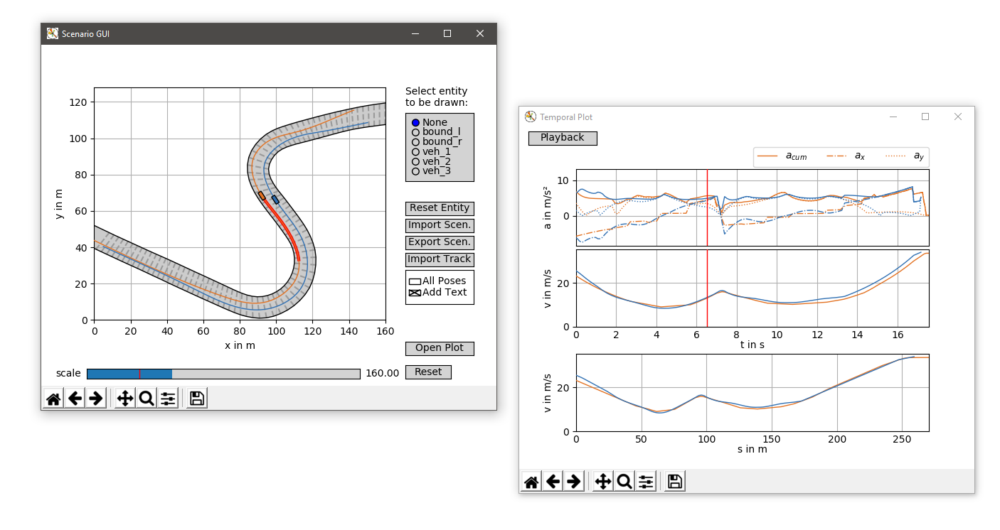

# Scenario Architect



The Scenario Architect is a basic python tool to generate, import and export short scene snapshots. These scenarios can 
be used for safety assessment metric evaluations or other benchmarks.

### Documentation
The documentation of the project can be found [here](https://scenarioarchitect.readthedocs.io/).

### People Involved

##### Core Developer
* [Tim Stahl](mailto:tim.stahl@tum.de)

##### Acknowledgements
Regina Harrer contributed during her Project Thesis to the calculation of the Time to Collision (TTC) score.

### Contributions
[1] T. Stahl and J. Betz, “An Open-Source Scenario Architect for Autonomous Vehicles,” 
in 2020 Fifteenth International Conference on Ecological Vehicles and Renewable Energies (EVER), 2020.\
[(view pre-print)](https://arxiv.org/pdf/2006.09731)

If you find our work useful in your research, please consider citing: 
```
@inproceedings{stahl2020a,
  title = {An Open-Source Scenario Architect for Autonomous Vehicles},
  booktitle = {2020 Fifteenth International Conference on Ecological Vehicles and Renewable Energies (EVER)},
  author = {Stahl, Tim and Betz, Johannes},
  year = {2020}
}
```