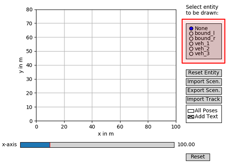
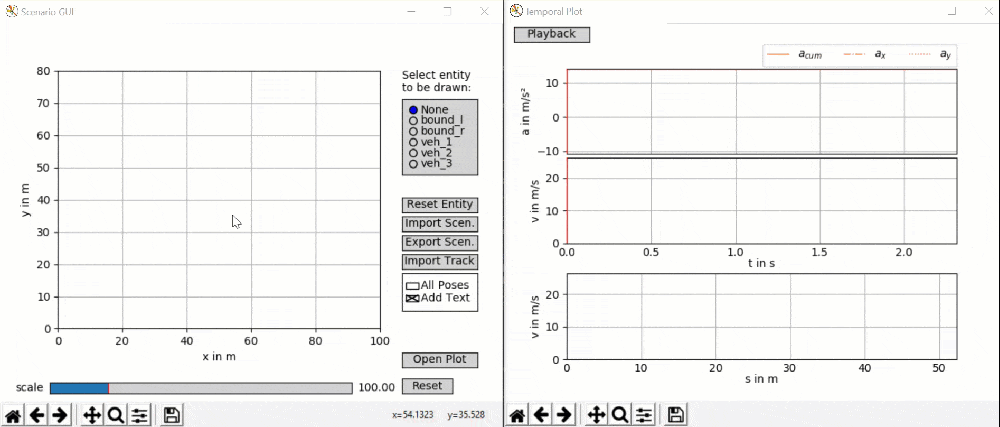
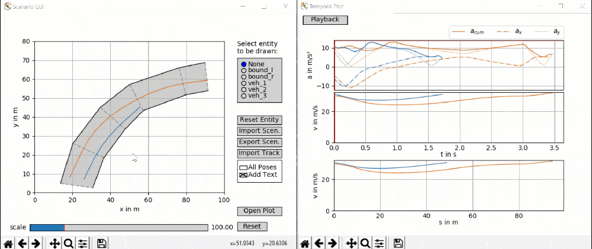

===================================
Basics
===================================

Selecting entities
====================================
Use the entity selector (highlighted red in Figure 1) to select a entity to be drawn or edited with the mouse.
Afterwards, use single clicks in the main axis to draw any desired shape. End editing a entity by double-clicking or
selecting any other entity in the entity selector. In order to remove all existing points of a certain entity, first
select the entry in the entity selector and then click the button `Reset Entity`.

*Figure 1: Scenario GUI window.*

Drawing entities
====================================
Use these basic manipulation techniques to establish track bounds (left and right) as well as vehicle paths. A track is
defined by a left and right bound, each holding pairwise coordinates (indicated by a dashed line between them). The
overall procedure is demonstrated in the animation below.

*Animation 1: Path and bound creation.*

Manipulating existing entities
====================================
When hovering above an 'x'-tick of the highlighted data-points (selected via the entity selector) in the main window,
you can left-click and drag the point to move it to a new position or right-click it to remove the point from the path.
The procedures are visualized in the animation below.

*Animation 2: Path modification - point dragging first, point deletion second.*
