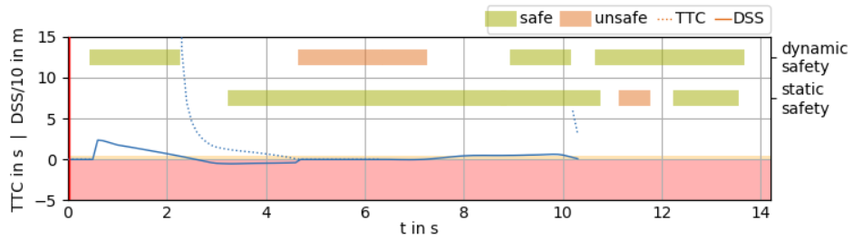

======================================================
Working with the Automatically Generated Safety Rating
======================================================
Once you start drawing any path for one of the vehicles, a safety rating for the given scenario is automatically
generated in the temporal plot window.

On one hand, the safety w.r.t. a static environment (static safety) is evaluated,
where intersections with the track limits, acceleration exceedance or kinematic constraint violations are considered for
the score.

On the other hand, the safety w.r.t. a dynamic environment (dynamic safety) is determined. In this favor, Surrogate
Safety Metrics (SSM) are evaluated along the course. Currently the Time to Collision (TTC) [dashed line in Fig. 1] and
Difference of Space distance and Stopping distance (DSS) [solid line in Fig. 2] are implemented. In the config file, it
is possible to specify which of the two should be used for the dynamic safety rating. The final rating is generated
based on configurable theshold (e.g. <0m for the DSS) and a check for lateral overlaps in the lane-based coordinate
system. Further details about the scores can be found in S. Mahmud et al. (S. M. S. Mahmud, L. Ferreira, Md. S. Hoque,
and A. Tavassoli, “Application of proximal surrogate indicators for safety evaluation: A review of recent developments
and research needs,” IATSS Research, vol. 41, no. 4, pp. 153–163, Dec. 2017, doi: 10/gf9kms.)

The resulting score for the static and dynamic safety along the course of the ego trajectory is visualized with green
and orange bar segments. Furthermore, the score is also exported with every time-stamp.

*Figure 1: Safety rating based on surrogate safety metrics.*
