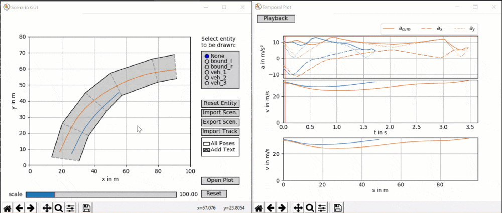
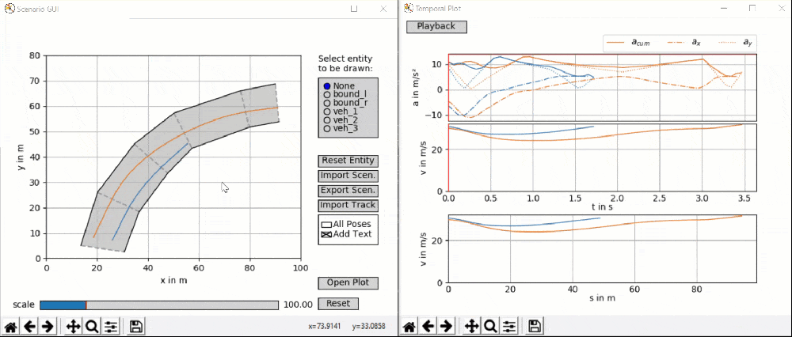

=================================================
Visualizing and Manipulating Temporal Information
=================================================
Once you start drawing any path for one of the vehicles, the temporal information is automatically generated in
parallel (see Animation 1). Thereby, the velocity profile is calculated in a way to drive as fast as possible on the
drawn path. Any desired modifications can be inserted manually.

.. image:: ../figures/BasicSetup.gif
  :width: 800
  :alt: Gif path and bound creation

*Animation 1: Path and bound creation.*

Visualize a specific timestamp
==============================
When moving the cursor above the temporal window, the corresponding vehicle poses are highlighted in the main window,
as shown in the animation below. That way it is possible to visualize the vehicle arrangement at any timestamp.

*Animation 2: Visualize temporal states.*

Modify the velocity profile of an entity
========================================
In order to modify the velocity of a certain vehicle manually, first select the vehicle in the 'Scenario GUI' window.
The corresponding temporal plots in the 'Temporal Plot' window will be highlighted with a bold stroke. Furthermore,
the spacial velocity profile will hold black dots that can be dragged up and down with the mouse in order to alter the
velocity profile. When holding and dragging a point sideways it is possible to batch process multiple points in a linear
manner. The velocity and acceleration profile is updated, once the mouse button is released. This process is
demonstrated in the animation below.

*Animation 3: Velocity profile manipulation.*

Static visualization of temporal information
============================================
Use the checkboxes 'All Poses' and 'Add Text' in the main window to display poses of the vehicles with a fixed temporal
spacing (default: every 1s - change this parameter in the config). Thereby, the 'Add Text' checkbox toggles the text
description next to every pose (NOTE: Due to performance issues, the text is displayed only for vehicles not currently
selected in the entity selector).

In order to plot the information displayed in the main window, it is possible to open with the button 'Open Plot' an
external window with the plot axis only (all GUI elements are removed) - e.g. useful for presentations or publications.
